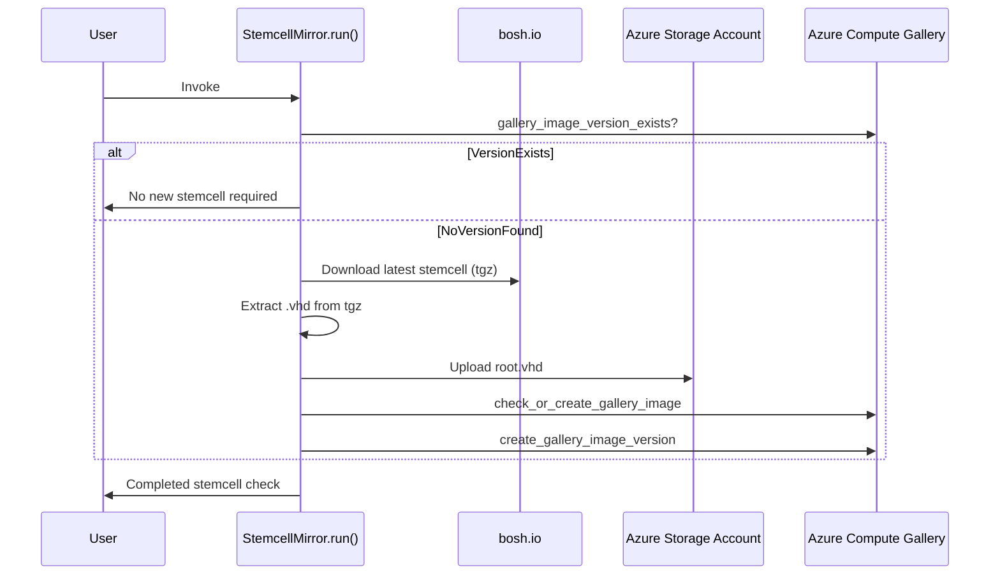

# bosh-azure-stemcell-mirror

[](https://github.com/s4heid/bosh-azure-stemcell-mirror/actions/workflows/test.yaml)
[](https://vscode.dev/redirect?url=vscode://ms-vscode-remote.remote-containers/cloneInVolume?url=https://github.com/s4heid/bosh-azure-stemcell-mirror)

This repository contains an Azure Function that mirrors BOSH stemcells from [bosh.io](https://bosh.io/stemcells) to an [Azure Compute Gallery](https://learn.microsoft.com/en-us/azure/virtual-machines/azure-compute-gallery) of your choice.

## Architecture



## Deployment

1. Get an Azure Subscription
2. Log-in to your Azure subscription using `azd auth login`.
3. Run `azd up` to provision your infrastructure and deploy to Azure (or run `azd provision` then `azd deploy` to accomplish the tasks separately).

## Development

1. Configure a Python virtual environment using `venv` or your tool of choice.

    ```bash
    python -m venv .venv
    source ./.venv/bin/activate
    ```

2. Install the required Python packages:

    ```bash
    python -m pip install -r requirements.txt
    ```

3. Run the unit tests:

    ```bash
    python -m unittest discover tests
    ```

## Related Topics

- [Deploying BOSH Stemcells from Azure Compute Gallery](docs/deploying-bosh-stemcells-from-azure-compute-gallery.md)
- [Mirror BOSH stemcells using metalinks](https://github.com/dpb587/upstream-blob-mirror/blob/master/repository/bosh.io/stemcell/_metalink)
