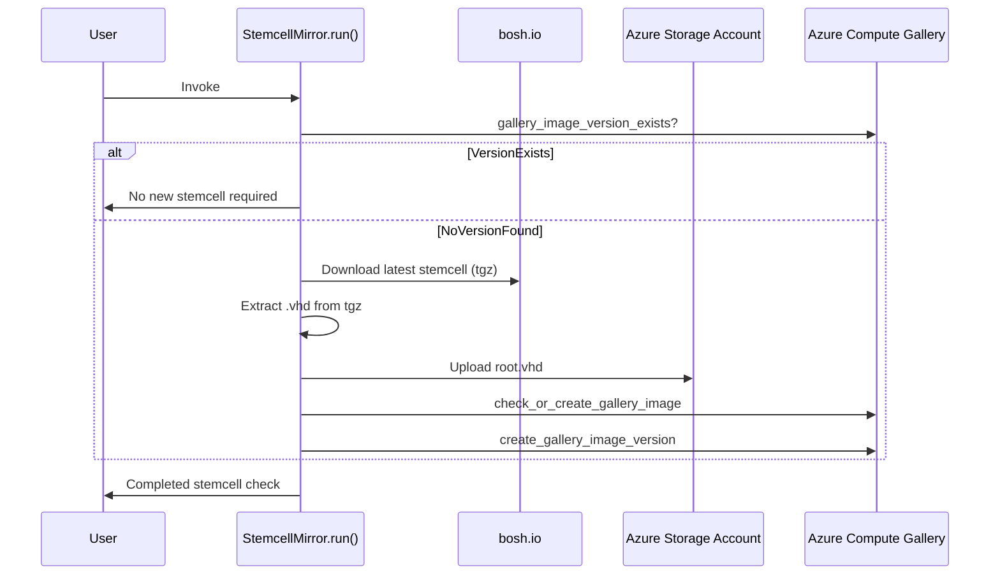

# bosh-azure-stemcell-mirror

[](https://github.com/s4heid/bosh-azure-stemcell-mirror/actions/workflows/test.yaml)
[](https://vscode.dev/redirect?url=vscode://ms-vscode-remote.remote-containers/cloneInVolume?url=https://github.com/s4heid/bosh-azure-stemcell-mirror)

This repository contains an Azure Container Apps Job that mirrors BOSH stemcells from [bosh.io](https://bosh.io/stemcells) to an [Azure Compute Gallery](https://learn.microsoft.com/en-us/azure/virtual-machines/azure-compute-gallery).

The job runs on a scheduled basis (daily by default) to check for new stemcell versions and automatically uploads them to your Azure infrastructure.

## Architecture



## Prerequisites

- [Azure Developer CLI (azd)](https://learn.microsoft.com/en-us/azure/developer/azure-developer-cli/install-azd)
- [Azure CLI (az)](https://docs.microsoft.com/en-us/cli/azure/install-azure-cli)
- [Docker](https://docs.docker.com/get-docker/)
- An Azure subscription

## Deployment

### Initial Setup

1. Clone this repository and navigate to the project directory.

2. Log in to your Azure subscription:

    ```bash
    azd auth login
    ```

3. Initialize the Azure Developer environment (if not already done):

    ```bash
    azd init
    ```

    You'll be prompted to provide:
    - **Environment name**: A unique name for your deployment (e.g., `stemcell-mirror-prod`)
    - **Azure location**: The Azure region where resources will be deployed (e.g., `eastus`)

### Deploy to Azure

Deploy the infrastructure and application in one command:

```bash
azd up
```

This command will:

- Provision all required Azure resources (see [Infrastructure](#infrastructure) section)
- Build the Docker container image
- Push the image to Azure Container Registry
- Deploy the Container Apps Job

Alternatively, you can run these steps separately:

```bash
azd provision  # Provision infrastructure
azd deploy     # Build and deploy the application
```

### Infrastructure

The deployment creates the following Azure resources:

| Resource Type | Purpose |
|---------------|---------|
| **Resource Group** | Container for all resources |
| **Container Registry** | Stores Docker images |
| **Storage Account** | Stores stemcell VHD files |
| **Compute Gallery** | Stores stemcell image definitions and versions |
| **Container Apps Environment** | Runtime environment for the job |
| **Container Apps Job** | Scheduled job that runs the mirror process |
| **Log Analytics Workspace** | Collects logs and telemetry |
| **Application Insights** | Application monitoring and diagnostics |
| **Key Vault** | Securely stores sensitive configuration (e.g., GitHub token) |
| **Managed Identity** | Provides authentication for Azure resources |

### Role Assignments

The managed identity is automatically assigned the following roles:

- **Contributor** (Resource Group scope): For managing compute resources
- **Storage Blob Data Contributor** (Storage Account scope): For uploading VHD files
- **AcrPull** (Container Registry scope): For pulling container images
- **Compute Gallery Sharing Admin** (Compute Gallery scope): For creating gallery images
- **Key Vault Secrets User** (Key Vault scope): For reading secrets from Key Vault

## Configuration

### Environment Variables

The application is configured through environment variables. These are automatically set during deployment but can be customized in [`infra/main.parameters.json`](infra/main.parameters.json).

#### (Required) Azure Deployment

These variables are automatically configured by the deployment:

| Variable | Description | Default |
|----------|-------------|---------|
| `AZURE_REGION` | Azure region | Deployment location |
| `AZURE_RESOURCE_GROUP` | Resource group name | Set automatically |
| `AZURE_SUBSCRIPTION_ID` | Azure subscription ID | Set automatically |
| `AZURE_MANAGED_IDENTITY_ID` | User Managed identity client ID | Set automatically |
| `AZURE_STORAGE_ACCOUNT_NAME` | Storage account name | Set automatically |
| `AZURE_GALLERY_NAME` | Azure Compute Gallery name | Set automatically |

#### (Optional) Azure Compute Gallery

| Variable | Description | Default |
|----------|-------------|---------|
| `BASM_GALLERY_PUBLISHER` | Gallery image publisher | `bosh` |
| `BASM_GALLERY_OFFER` | Gallery image offer | Extracted from stemcell series |
| `BASM_GALLERY_SKU` | Gallery image SKU | Extracted from stemcell series |
| `BASM_GALLERY_IMAGE_NAME` | Gallery image definition name | Extracted from stemcell series |

#### (Optional) Stemcell

##### bosh.io

| Variable | Description | Default |
|----------|-------------|---------|
| `BASM_STEMCELL_SERIES` | BOSH stemcell series to mirror (from bosh.io) | `bosh-azure-hyperv-ubuntu-jammy-go_agent` |
| `BASM_MOUNTED_DIRECTORY` | Directory for temporary extraction. | `/stemcellfiles` |

> [!IMPORTANT]
> The `BASM_STEMCELL_SERIES` environment variable must be set to a valid bosh.io stemcell series name (e.g. `bosh-azure-hyperv-ubuntu-noble-go_agent`, `bosh-azure-hyperv-ubuntu-jammy-go_agent`, `bosh-azure-hyperv-ubuntu-xenial-go_agent`).
>
> A list of available stemcell series can be found at [bosh.io/stemcells](https://bosh.io/stemcells/).

##### Ephemeral Storage

| Variable | Description | Default |
|----------|-------------|---------|
| `BASM_MOUNTED_DIRECTORY` | Directory for temporary extraction. | `/stemcellfiles` |

> [!NOTE]
> The `BASM_MOUNTED_DIRECTORY` allows you to set a custom temporary extraction directory within the container. This is helpful if you want to use smaller container sizes with ephemeral storage for extraction, since downloaded stemcells are usually larger than 5GB.

#### (Optional) Notification

The stemcell mirror can send out a notification about successful upload of new stemcells.

##### GitHub Actions Workflow Dispatch

Configure these variables to dispatch an external GitHub Actions workflow whenever a new stemcell version is published. The `BASM_NOTIFY_GITHUB_TOKEN` must be stored in Azure Key Vault as a secret named `github-token`. If this secret is not set, notifications remain disabled.

| Variable | Description | Default |
|----------|-------------|---------|
| `BASM_NOTIFY_GITHUB_TOKEN` | GitHub token with `workflow` scope (stored in Key Vault as `github-token`) | _Required to enable notifications_ |
| `BASM_NOTIFY_GITHUB_API_URL` | GitHub API base URL (`https://api.github.com` for GitHub.com, `https://<ghe-host>/api/v3` for GHES) | `https://api.github.com` |
| `BASM_NOTIFY_GITHUB_OWNER` | GitHub repository owner | - |
| `BASM_NOTIFY_GITHUB_REPO` | GitHub repository name | - |
| `BASM_NOTIFY_GITHUB_WORKFLOW` | Workflow filename or ID to dispatch | - |
| `BASM_NOTIFY_GITHUB_REF` | Branch or tag reference used for the workflow dispatch | - |

##### Setting the GitHub Token in Key Vault

After the initial deployment, store your GitHub token in Key Vault:

```bash
az keyvault secret set \
  --vault-name <key-vault-name> \
  --name github-token \
  --value "<your-github-token>"
```

You can find the Key Vault name in the `.azure/<environment-name>/.env` file:

```bash
AZURE_KEY_VAULT_NAME=<key-vault-name>
```

> [!NOTE]
> The GitHub token requires the `workflow` scope to trigger GitHub Actions workflow dispatches.

### Resource Configuration

#### Job Resources

The Container Apps Job is configured with:

- **CPU**: 1.0 cores
- **Memory**: 2.0 GiB
- **Replica timeout**: 900 seconds (15 minutes)
- **Retry limit**: 1 attempt

These can be adjusted in [`infra/app/app.bicep`](infra/app/app.bicep) if needed.

#### Storage Volume

The job uses an EmptyDir volume mounted at `/stemcellfiles` for temporary extraction of stemcell archives. This provides better performance than using system temp directories.

## Manual Execution

To manually trigger the job:

```bash
az containerapp job start --name <job-name> --resource-group <resource-group>
```

You can find the job name and resource group in the `.azure/<environment-name>/.env` file after deployment:

```bash
AZURE_CONTAINER_APPS_JOB_NAME=<job-name>
AZURE_RESOURCE_GROUP=<resource-group>
```

## Monitoring

### Viewing Logs

View logs in Azure Portal:

1. Navigate to your Container Apps Job
2. Select **Execution history**
3. Click on a specific execution to view logs

Or use Azure CLI:

```bash
az containerapp job execution list \
  --name <job-name> \
  --resource-group <resource-group>
```

### Application Insights

Application telemetry is automatically collected in Application Insights. You can query logs and metrics through the Azure Portal or using KQL queries.

## Development

### Local Development Setup

1. Configure a Python virtual environment:

    ```bash
    python -m venv .venv
    source ./.venv/bin/activate
    ```

2. Install development dependencies:

    ```bash
    pip install -r requirements-dev.txt
    ```

### Running Tests

Run the unit tests:

```bash
python -m unittest discover tests
```

### Local Execution

To run the application locally, you need to set the required environment variables:

```bash
export AZURE_SUBSCRIPTION_ID="<your-subscription-id>"
export AZURE_RESOURCE_GROUP="<your-resource-group>"
export AZURE_STORAGE_ACCOUNT_NAME="<your-storage-account>"
# ... other required variables (see .env.template)

python src/main.py
```

> [!IMPORTANT]
> Local execution requires Azure credentials. Use `az login` to authenticate.

### Code Quality

The project uses Ruff for linting and Black for code formatting. Configuration is in [`pyproject.toml`](pyproject.toml):

```bash
# Format code
black src/ tests/

# Lint code
ruff check src/ tests/
```

## Cleanup

To delete all Azure resources:

```bash
azd down
```

This will remove the resource group and all associated resources.

## Related Topics

- [Deploying BOSH Stemcells from Azure Compute Gallery](docs/deploying-bosh-stemcells-from-azure-compute-gallery.md)
- [Mirror BOSH stemcells using metalinks](https://github.com/dpb587/upstream-blob-mirror/blob/master/repository/bosh.io/stemcell/_metalink)
